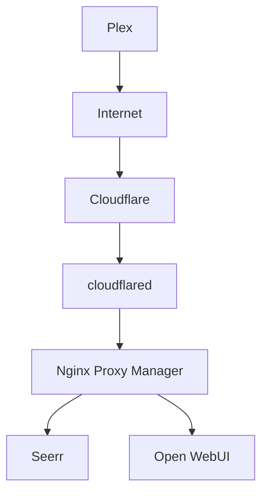
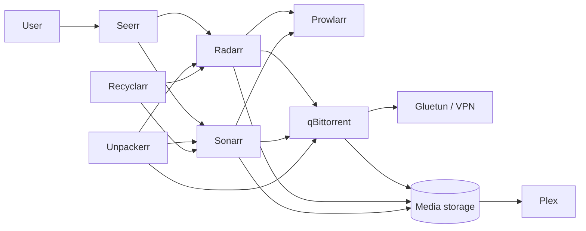
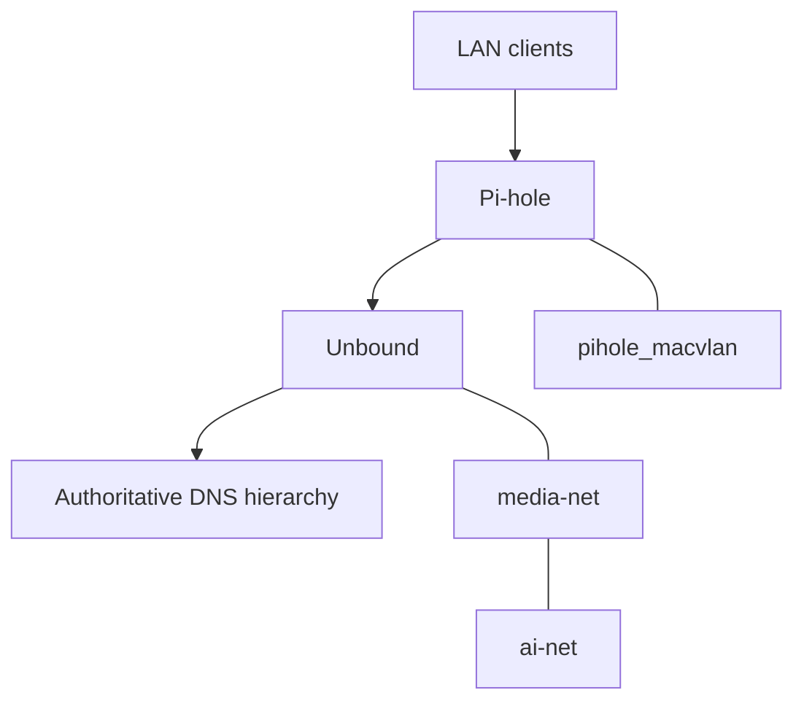
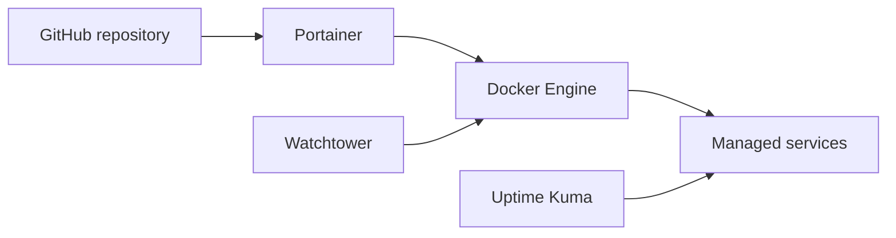

# Homelab Dependency Map

This page provides a quick visual model of how the major services relate to one another. It is intentionally simplified and should be updated when networks, ingress paths, or service dependencies change.

## External Access and Application Flow

Cloudflare Tunnel provides authenticated ingress for selected services. Plex currently uses its own remote-access path and is intentionally shown separately.

## Media Automation Flow

qBittorrent shares Gluetun's network namespace, so both containers must be treated as a coupled unit during updates and recovery.

## DNS and Local Networking

The network boxes represent logical Docker connectivity, not unrestricted routing between every attached service.

## Operations and Monitoring

Git is the intended configuration source, Portainer is the deployment interface, Watchtower updates only explicitly labeled containers, and Uptime Kuma observes service availability.

## Maintenance Notes

- Update this map after adding a major service, network, database, or ingress path.
- Keep sensitive hostnames, credentials, and tunnel tokens out of diagrams.
- Use the individual stack READMEs and service documentation for exact ports, mounts, and recovery procedures.
